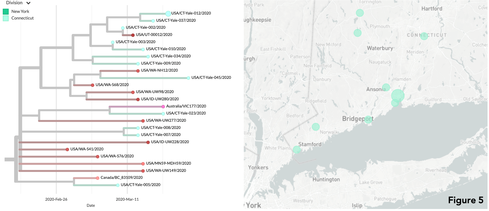

# Update 2 | 2020.04.07 - Yale SARS-CoV-2 Genome Surveillance Initiative
This github repository shows preliminary results related to 13 new SARS-CoV-2 genomes (from CT[10] and NY[3]) from clinical samples collected between March 18-19, 2020. These samples were sequenced by [Joseph Fauver](https://twitter.com/JosephFauver) and and [Tara Alpert](https://twitter.com/tdalpert), using a MinION platform. Phylogenetic analysis and results interpretation were performed by [Anderson Brito](https://twitter.com/AndersonBrito_), using a nextstrain pipeline.

## Data
The directories `consensus_genomes` and `metadata` in the [main page](https://github.com/grubaughlab/CT-SARS-CoV-2) in this repository contain all of our current SARS-COV-2 genomes and metadata.

## Interpretation

*WARNING: These results should be considered as preliminary data*

We added the new 13 SARS-COV-2 genomes with other 27 genomes we presented in the previous update, and collected other 267 genomes available on GISAID, from around the world, to uncover recent patterns of viral spread within and from Northeastern USA in the past weeks.

### A growing cluster of viruses between Connecticut and New York State
Nine of the newly sequenced genomes in this update are found within a growing cluster of viruses sampled in NY and CT between March 12th and 25th, 2020. They add extra evidence for sustained local or regional transmission of the virus causing COVID-19 within and between both states.

### 
The newly sequenced virus Yale-020 is genetically related to viruses that may be circulating locally in Connecticut over the past weeks. These samples, all sequenced by our lab, were collected from patients residents of the New Haven County and surrounding areas. The data for the specific lineage is still limited, and as we sequence more genomes, we may be able to estimate the extent of the viral spread from this region in CT.

In another branch of the phylogenetic tree one can find four genomes sequenced by the Yale initiative (Yale-013, 047, 050), one of them sequenced in the last week (Yale-024). These genomes are grouped within a cluster of viruses likely originated from Western Europe, suggesting at least one introduction of this lineage in the United States at some point in February.

Finally, one of the genomes (Yale-012) groups together with other 12 sequenced by our team, which were found to group with genomes of viruses most likely introduced from Washington state (see Update 1). These CT samples were collected from residents of many distinct locations in CT, such as the sourthern CT towns/city of New Haven, West Haven, Greenwich, Woodbridge, and Stratford, as well as Bethlehem, Litchfield, and Berlin, in the northern part.

Altogether, the patterns we observe with the genomic data gathered so far highlights that the virus causing COVID-19 is widely spread in Connecticut. Staying home, specially the elderly and people with underlying health conditions, is advisable to avoid exposure to the virus SARS-CoV-2.

## Nextstrain

The directory `auspice` contains a json that was produced using the 'augur' from the nextstrain pipeline. The results can be visualized using auspice, accessing the link below:

* [Yale SARS-CoV-2 Genome Surveillance Initiative (Update 2)](https://nextstrain.org/community/grubaughlab/CT-SARS-CoV-2/update2)

---

**Grubaugh Lab** | Yale School of Public Health (YSPH) | [https://grubaughlab.com/](https://grubaughlab.com/)
