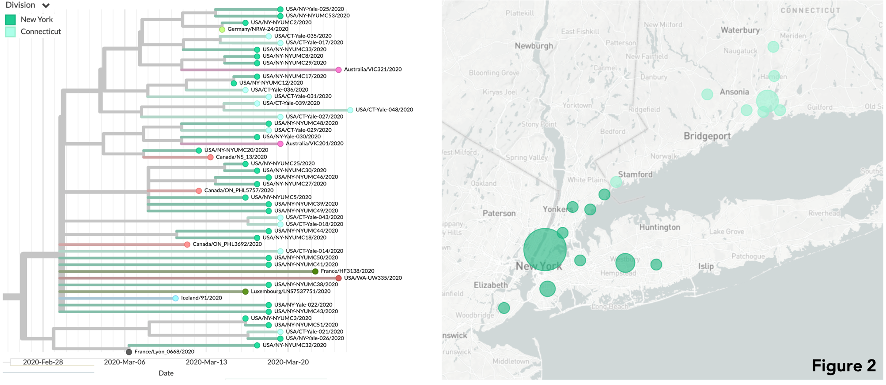
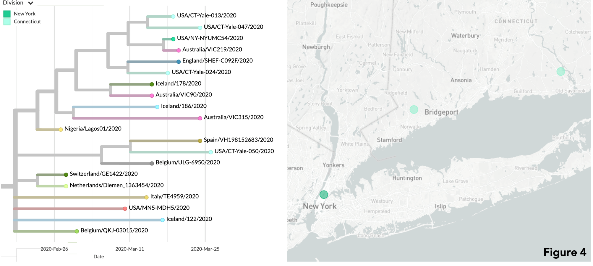
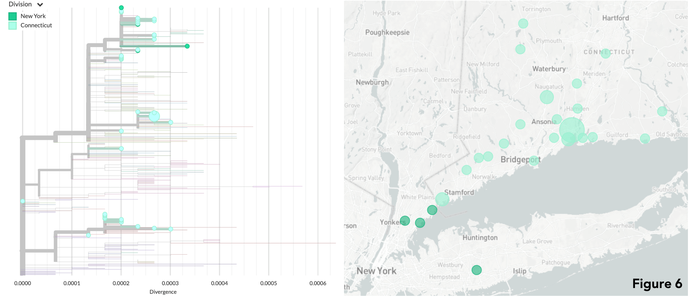

# Update 2 | 2020.04.07 - Yale SARS-CoV-2 Genome Surveillance Initiative
This github repository shows preliminary results related to 13 new SARS-CoV-2 genomes (from CT[10] and NY[3]) from clinical samples collected between March 18-19, 2020. These samples were sequenced by [Joseph Fauver](https://twitter.com/JosephFauver) and and [Tara Alpert](https://twitter.com/tdalpert), using a MinION platform. Phylogenetic analysis and results interpretation were performed by [Anderson Brito](https://twitter.com/AndersonBrito_), using a `nextstrain` pipeline. The results reported here can be found in [this external link.](https://nextstrain.org/community/grubaughlab/CT-SARS-CoV-2/update2)

## Data
The directories `consensus_genomes` and `metadata` in the [main page](https://github.com/grubaughlab/CT-SARS-CoV-2) in this repository contain all of our current SARS-COV-2 genomes and metadata.

## Interpretation

*WARNING: These results should be considered as preliminary data*

We added the new 13 SARS-COV-2 genomes with other 27 genomes we presented in the [previous update](https://github.com/grubaughlab/CT-SARS-CoV-2/tree/master/update1), and collected other 267 genomes available on GISAID, from around the world, to uncover recent patterns of viral spread within and from Northeastern USA in the past weeks.

### A growing cluster of viruses between Connecticut and New York State
Nine of the newly sequenced genomes in this update are found within a growing cluster of viruses sampled in NY and CT between March 12th and 25th, 2020. They add extra evidence for sustained local or regional transmission of the virus causing COVID-19 within and between both states.

### Uncertain sources and fates
The newly sequenced virus Yale-020 is genetically related to viruses collected in Connecticut over the past weeks. These samples, all sequenced by our lab, were obtained from patients residents of the New Haven County and surrounding areas, but it is still uncertain if these five viruses are causing sustained local transmission chains. Given the current data, and the genetic similarity of these genomes with those found in viruses from Europe, an international origin of these viruses, followed by continued circulation in Clinton and Beacon Falls in a plausible scenario (see map).

### Uncertain sources and fates
In another branch of the phylogenetic tree one can find four genomes sequenced by the Yale initiative (Yale-013, 047, 050), one of them sequenced in the last week (Yale-024). These genomes are grouped within a cluster of viruses likely originated from Western Europe, suggesting at least one introduction of this lineage in the United States at some point in February.

### Potential seeds of viral spread
Finally, one of the genomes (Yale-012) groups together with other 12 sequenced by our team, which were found to group with genomes of viruses most likely introduced in a [coast-to-coast SARS-CoV-2 transmission](https://www.medrxiv.org/content/10.1101/2020.03.25.20043828v1) from the Washington state. These CT samples were collected from patients residents of several distinct locations in Connecticut, such as the sourthern towns/cities of New Haven, West Haven, Greenwich, Woodbridge, and Stratford, as well as Bethlehem, Litchfield, and Berlin, in the northern part.

# The bottom line
Altogether, the patterns we observe using genomic data and phylogenetic analysis highlight that the virus causing COVID-19 is probably widely spread in Connecticut, especially in the coastline area between Hartford and New York City ([zoom in the map](https://nextstrain.org/community/grubaughlab/CT-SARS-CoV-2/update2?f_update=Initial,Update01,Update02&m=div&p=grid&r=location)). Staying home is an advisable action to avoid exposure to the virus SARS-CoV-2. This applies to young and adult populations (silent, assimptomatic viral spreaders), and especially for the elderly and people with underlying health conditions, those suffering severe burdens of COVID-19.

## Nextstrain

The directory `auspice` contains a json file that was produced using the `augur` nextstrain pipeline. The results presented above can be visualized online by accessing the link below:

* [Yale SARS-CoV-2 Genome Surveillance Initiative (Update 2)](https://nextstrain.org/community/grubaughlab/CT-SARS-CoV-2/update2)

---

**Grubaugh Lab** | Yale School of Public Health (YSPH) | [https://grubaughlab.com/](https://grubaughlab.com/)
