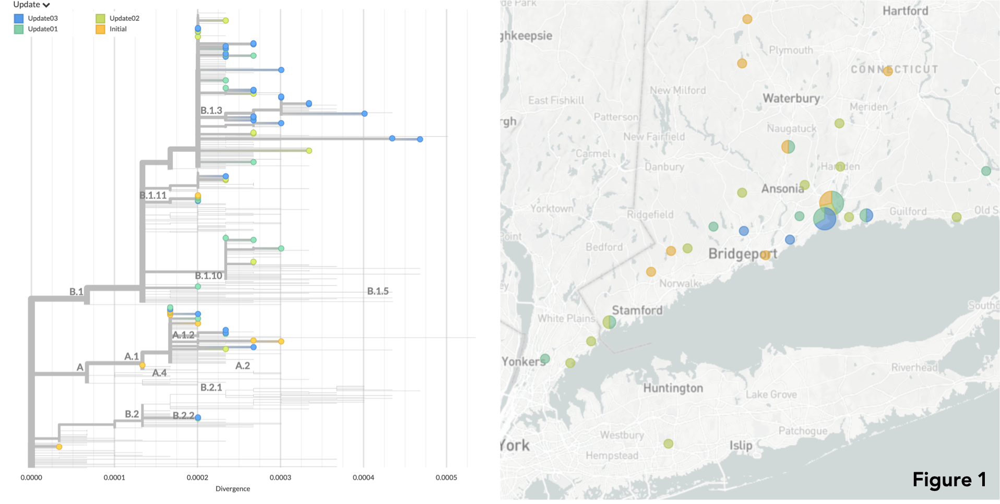

# Update 3 | 2020.04.14 - Yale SARS-CoV-2 Genome Surveillance Initiative
This GitHub repository shows preliminary results related to **30 new SARS-CoV-2 genomes** from clinical samples collected in Connecticut between March 11 and April 08, 2020. These samples were sequenced by [Joseph Fauver](https://twitter.com/JosephFauver) and [Tara Alpert](https://twitter.com/tdalpert), using a MinION platform. Phylogenetic analysis were performed and results were interpreted by [Anderson Brito](https://twitter.com/AndersonBrito_). The results reported in this update were obtained using a `nextstrain` pipeline, and can be also visualized [here.](https://nextstrain.org/community/grubaughlab/CT-SARS-CoV-2/update3)

## Data
The directories `consensus_genomes` and `metadata` in the [main page](https://github.com/grubaughlab/CT-SARS-CoV-2) in this repository contain all of our current SARS-COV-2 genomes and metadata.

## Interpretation

*WARNING: These results should be considered as preliminary data: they may change in light of new evidences.*

### Dataset
We combined our new dataset of 30 SARS-COV-2 genomes with other 40 genomes shown by our team in the [Update 2](https://github.com/grubaughlab/CT-SARS-CoV-2/tree/master/update2). Figure 1 below shows where all genomes released by the Yale SARS-CoV-2 Genome Surveillance Initiative were collected. To perform preliminary analysis, we also collected other 410 genomes available on GISAID, from around the world and the US, to uncover recent patterns of viral spread within and from Northeastern USA in the past weeks. We thank the authors of the genomes in such complementary dataset: a list of authors is provided at the bottom of our dedicated [nextstrain build.](https://nextstrain.org/community/grubaughlab/CT-SARS-CoV-2/update3?c=author)

### The nomenclature of the virus SARS-CoV-2
A nomenclature system for the main SARS-CoV-2 lineages was proposed by leading virologists and evolutionary biologists last April 8th (full description and rationale can be found [here](http://virological.org/t/a-dynamic-nomenclature-for-sars-cov-2-to-assist-genomic-epidemiology/458)). In our reports we will start to refer to viral lineages using such system. Viruses sequenced by our initiative are found in both major SARS-CoV-2 lineages: lineage A and B, which in turn are divided into nested sub-lineages. So far, in lineage A our viral genomes cluster within the lineage A1, and the sub-lineage A1.2. On lineage B, the biggest group among SARS-CoV-2, our sequenced genomes cluster within B1 (sub-lineages B1.3, B1.11) and B2 (see Figure 1).

### Coast-to-coast transmission within lineage A1
Lineage A1 is so far composed mostly by genomes collected in the US and Canada. Canadian genomes cluster in a sister group where a previously sequenced Connecticut genomes is also found (Yale-005), forming a basal group with viruses from British Columbia, one of the earliest places were lineage A1 was introduced. With the data available so far, we observe mostly introductions of viruses from Washington State into Connecticut, as shown in a previous [manuscript](https://www.medrxiv.org/content/10.1101/2020.03.25.20043828v1) by our group. As more data are available, this scenario may change, likely showing intermediate steps of transmission involving other states or regions in North America. This interpretation was made possible by our viral genomic data, and data publicly available by [Harrigan et al](https://nextstrain.org/community/grubaughlab/CT-SARS-CoV-2/update3?c=author&f_author=Harrigan%20et%20al,Fauver%20et%20al&label=clade:A.1)(BCCDC Public Health Laboratory).

### Lineage B2 in Connecticut: international or domestic introduction?
One of our newly sequenced genomes (Yale-055) groups with Yale-028 in lineage B2, and may reveal the beginning of a new transmission chain in CT, which was likely seeded by an early international viral introduction from Europe, or from viruses circulating in the Northeastern US. As the number of genomes grows, this pattern will be better solved.

### Lineage B1 is responsible by most outbreaks in NY and CT
Most genomes from NY state belong to sub-lineages of B1, and 24 out of 30 genomes from CT reported in this update cluster in this lineage, and were collected between March 11th and April 8th. The lineage B1 was most likely introduced in Northeastern US from Western Europe in multiple events. Genomes from NY and CT and closely related and, as shown in our [previous update](https://github.com/grubaughlab/CT-SARS-CoV-2/tree/master/update2), this pattern suggest constant introduction of viruses are taking place from New York into Connecticut.

### Sub-lineage B1.11 is mainly found in Connecticut
Six genomes sequenced by our team, one of them (Yale-068), belongs to the lineage B1.11, and can be distinguished by a mutation on ORF1b (A88V). This lineage was most likely introduced from Northern Europe into CT or NY, a pattern evidenced both by our data, and by data generated by [Gonzalez-Reiche et al](https://nextstrain.org/community/grubaughlab/CT-SARS-CoV-2/update3?c=division&f_author=Ana%20Gonzalez-Reiche%20et%20al,Fauver%20et%20al&label=clade:B.1.11&p=grid)(MSHS Pathogen Surveillance Program). Genomic data shows that sub-lineage B1.11 is now mainly circulating in Connecticut, at least on Beacon Falls, Clinton and surrounding areas.

# The bottom line
Using genomic epidemiology, SARS-CoV-2 genomes sequenced from Connecticut ([Figure 6](https://nextstrain.org/community/grubaughlab/CT-SARS-CoV-2/update3?c=country&f_division=Connecticut&m=num_date)) show multiple independent coronavirus lineages circulating in the state, especially by the coastline towards New York. If the peak number of cases being [projected to late April](https://covid19.healthdata.org/united-states-of-america/connecticut), it continues to be advisable to stay at home and avoid exposure to the virus SARS-CoV-2. This applies to young and adult populations (silent, asymptomatic viral spreaders), and especially to the elderly and people with underlying health conditions, those suffering severe burdens of COVID-19.

# See these results on Nextstrain

The directory `auspice` contains a json file that was produced using the `augur` nextstrain pipeline. The results presented above can be visualized online by accessing the link below:

* [Yale SARS-CoV-2 Genome Surveillance Initiative (Update 3)](https://nextstrain.org/community/grubaughlab/CT-SARS-CoV-2/update3)

---

**Grubaugh Lab** | Yale School of Public Health (YSPH) | [https://grubaughlab.com/](https://grubaughlab.com/)
